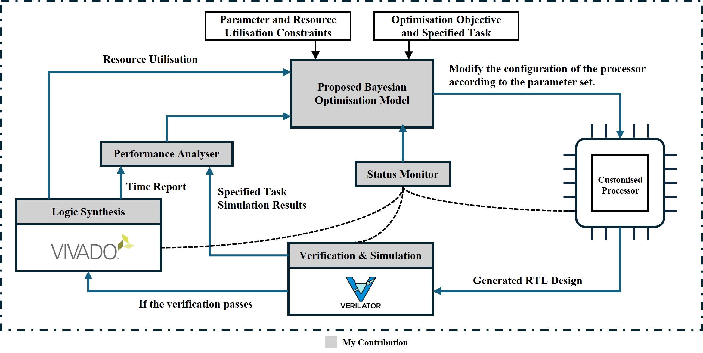

# Automated Customisable Processor Design Platform

This project proposes a automated customisable processor design platform based on Bayesian Optimisation. The platform is able to optimise the processor's performance based on the user's requirements. It could consider both the parameter constraints from the customisable processor's specification and the resource utilisation constraints. 



## Setup

```git submodule init```

Do the modifications as shown in [Processor Setup](object_functions/README.md)

## Run the model

To run this code, run the following command in the terminal:

```cd src``` \
```python3 optimisation.py```

The model settings are all in ```src/optimisation_models.py```

The optimisation task's settings are all stored in ```specifications/```

## Record Results

To record the results, change the record flag in ```optimisation.py``` to be true. The record data will be stored in ```test/test_results/```

To plot the results, the tools are provided in ```test/plot_tools/```

The plot tools are stored in ```test/plot_results/```


## Supported Cores

As detailed in the [Processor Setup](object_functions/README.md), the following cores are supported:
- NutShell
- VeeR EL2 RISC-V Core
- Rocket Chip v1.6
- SCR1


## Functionality
- Support Parameter Constraints among the parameters, including both self and conditional constraints.
- Support Resource Utilisation Constraints.
- Optimised for integer-valued and categorical parameters.
- Support multi-objective optimisation.
- Fully automated design platform for customisable processors.

## Documentation and Information
Ce Guo, Haoran Wu, and Wayne Luk. Resource-constraint bayesian optimization for soft processors on fpgas.
In 14th International Symposium on Highly Efficient Accelerators and Reconfigurable Technologies (HEART ’24), pages 1–13, Porto, Portugal, June 19-21 2024. ACM. doi: 10.1145/3665283.3665291. pages 4, 23, 28

<!-- ## Current Progress

- Formatted Input Constraints
- Built a simple model
- Modified the model to be able to optimise for multiple-objectives
- Modified the model to be aware of the output constraints, making it able to find design with the output within a range.
- Implemented constraint interface.
- Implemented the brute force method to compare the efficiency of the model.
- Apply transformation to the tensor for forward pass to the covariance kernel.
- Improve the initial Sampling method.
- Select the sample point to decide whether it shoud be integrated to the training set.
- Connect the model with the real customisable processor.
- Complete the overall optimisation flow.
- Enable the model to accept categorical variables.
- Categorical Variable Kernel Optimisation.
- Invalid designs handling. -->

