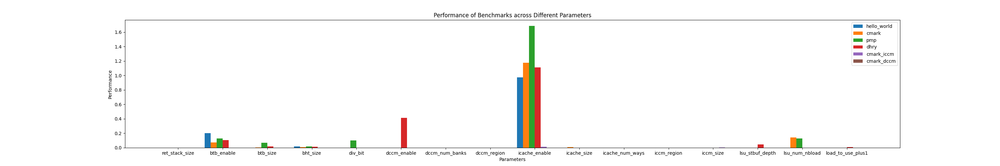

# Cores-VeeR-EL2 Report

## 1. Parameter Selection

To briefly go through all the impacts of the parameters, experiments based on different benchmarks were conducted. Each trial only changes one parameter while keeping the others as the default values. The ratio of (max - min) / (number of instructions retired) for benchmarks results of each parameter and represented this data in the bar chart below. Parameters that showed no impact across all benchmarks were excluded.

## 2. Optimisation Set 1

For the first optimisation set. This optimisation set mainly focuses on the BTB and LSU parts. The corresponding design space size is 2x5x3x3 = 90 and the following parameters were selected:

| Parameter | Range | Description |
| --- | --- | --------------------------------------- |
| btb enabled | 0, 1 | Branch Target Buffer |
| btb size | 32, 64, 128, 256, 512 | Branch Target Buffer Size |
| lsu_num_nbload | 2, 4, 8 | Num of Non-blocking loads executed by the Load Store Unit (LSU) |
| lsu_stbuf_depth | 2, 4, 8 | Depth of the store buffer within the LSU |

The output objective is 
| Objective | Optimisation Direction | Range |
| --- | --- | --- |
| mcycle for cmark | Minimise | 400000 - 420000 |
| mcycle for dhrystone | Minimise | 350000 - 370000 |
| LUT as Logic | Constraints | 30000 - 33000 |

BTB Impact Analysis:

  
  

LSU Impact Analysis:

  
  

## 3. Optimisation Set 2

For the second optimisation set. This optimisation set mainly focuses on the ICCM and DCCM parts. The corresponding design space size is 8x2x8x3 = 384 and the following parameters were selected:

| Parameter | Range | Description |
| --- | --- | --------------------------------------- |
| dccm_size | 4, 8, 16, 32, 64, 128, 256, 512 | DCCM Size |
| dccm_num_banks | 2, 4 | Num of Banks of DCCM |
| iccm_size | 4, 8, 16, 32, 64, 128, 256, 512 |ICCM Size |
| iccm_num_banks | 2, 4, 8 | Num of Banks of ICCM |

The output objective is 
| Objective | Optimisation Direction | Range |
| --- | --- | --- |
| mcycle for iccm | Minimise | 300000 - 320000 |
| mcycle for dccm | Minimise | 290000 - 310000 |
| LUT as Logic | Constraints | 30000 - 33000 |

ICCM Impact Analysis:

  
  

DCCM Impact Analysis:

  
  

